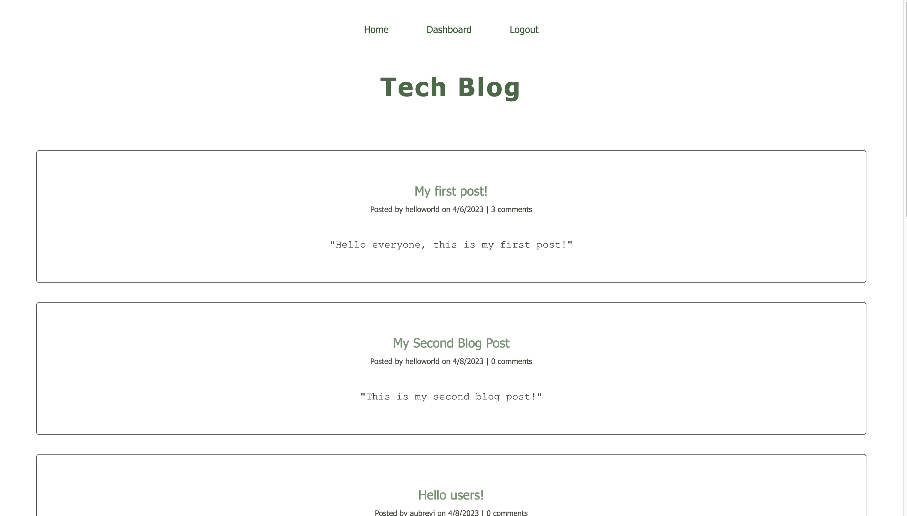

# CMS-Style Blog Site
#### Aubrey Johnston
 

## Technologies Used
<ul>
    <li>Node.js</li>
    <li>Express</li>
    <li>MySQL</li>
    <li>Sequelize</li>
    <li>Dotenv</li>
    <li>Bcrypt</li>
    <li>Handlebars</li>
</ul>    

 

## Description

This is a full stack application that allows users to create accounts, sign in, create blog posts and upload them as well as comment on other peoples' posts! The motivation behind this app was to create a place for people to gather and share their ideas while also being in a secure environment that is password protected. I learned through this project that using routes and handlebars is not as straightforward as it may look, and it took some time to get it functioning the way I wanted it to but overall it was a great learning experience. 

 

 

## Installation
No installation required. Just visit the deployed website link:
 

[Tech Blog Link](https://arcane-inlet-49732.herokuapp.com/)

 

## Usage
Log in to your account or, if you are a new user, create a new account and then log in. You will be taken to the homepage with posts from other users and you will be able to comment on their posts as well as create new posts of your own! To view all of your posts, go to the dashboard link at the top. Each session will be automatically signed out after about five minutes.

   

 